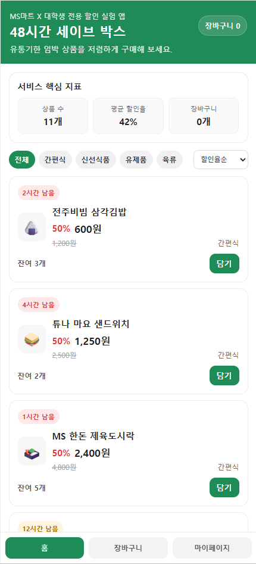
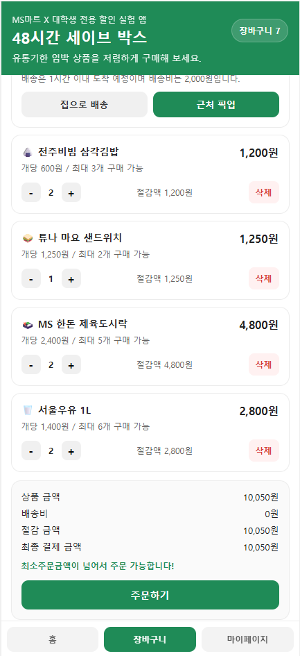
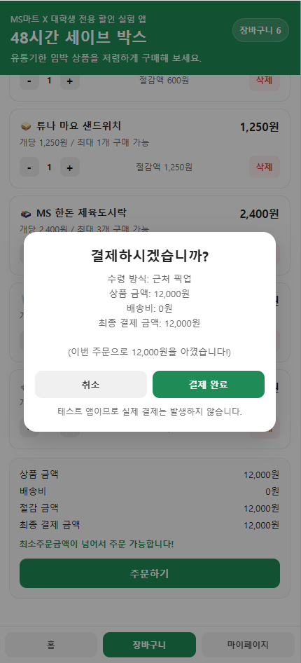
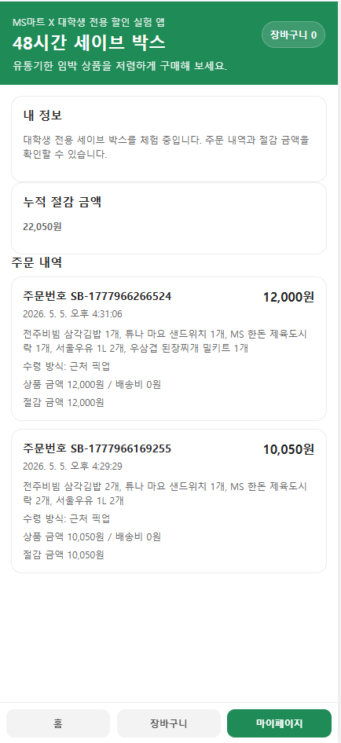

# 🛒 48시간 세이브 박스 (Save Box)

> 유통기한 임박 상품을 할인 판매하는 모바일 웹 서비스

---

## 📌 프로젝트 소개

**48시간 세이브 박스**는 유통기한이 임박한 상품을 할인된 가격으로 제공하여
사용자는 합리적인 소비를 할 수 있고, 동시에 식품 폐기 문제를 줄일 수 있도록 기획된 서비스입니다.

모바일 환경을 중심으로 설계되었으며,
상품 탐색부터 장바구니, 결제, 주문 내역 확인까지 **하나의 흐름으로 이어지는 커머스 경험**을 구현했습니다.

---

## 🎬 서비스 미리보기

---

## 🚀 주요 기능

### 🛍️ 상품 탐색

* 카테고리 기반 필터링 (간편식 / 신선식품 / 유제품 / 육류)
* 할인율, 가격, 유통기한 기준 정렬 기능
* 유통기한 임박 정도를 시각적으로 표현하는 UI

---

### 🧺 장바구니 시스템

* 상품 추가 및 삭제, 수량 조절 기능
* 재고 기반 수량 제한 처리
* 실시간 금액 계산 및 절감 금액 표시

---

### 💳 결제 흐름

* 최소 주문 금액 조건 검증
* 커스텀 모달 기반 결제 인터페이스
* 주문 데이터 생성 및 상태 반영

---

### 📊 사용자 정보

* 주문 내역 기록 및 조회
* 누적 절감 금액 계산 및 시각화

---

## 🧠 기술적 특징

### 상태 기반 UI 구성

애플리케이션 전반의 데이터를 하나의 상태 객체로 관리하고,
상태 변화에 따라 UI를 재구성하는 구조로 설계했습니다.

### 동적 렌더링 구조

상품 목록, 장바구니, 주문 내역 등 주요 UI를
데이터 기반으로 생성하여 일관된 렌더링 흐름을 유지했습니다.

### 사용자 경험 중심 인터랙션

기본 브라우저 팝업 대신 커스텀 모달을 활용하여
보다 자연스럽고 일관된 사용자 경험을 제공하도록 구현했습니다.

### 데이터 검증 로직

장바구니 및 결제 단계에서 재고와 주문 조건을 검증하여
실제 서비스 환경을 고려한 안정적인 흐름을 구성했습니다.

---

## 🛠️ 사용 기술

* HTML5
* CSS3
* Vanilla JavaScript (ES6+)

---

## 🎯 프로젝트 포인트

* 단순 UI 구현을 넘어 **전체 커머스 흐름을 직접 설계 및 구현**
* 상태 관리, 이벤트 처리, UI 렌더링을 유기적으로 연결한 구조
* 실제 서비스 시나리오를 기반으로 한 사용자 경험 중심 개발
